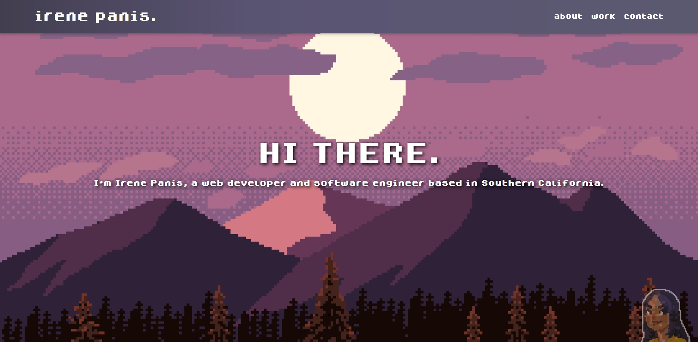

# Module 2 Challenge - Portfolio

## Description

This project is a portfolio showcasing my personal background and my work as a developer in order to provide a quick and brief summary of my web development capabilities. It contains a quick biography, some links to work samples, and information on how to contact me.

## Usage/Preview

Users will be able to scroll through the entire page and observe different sections containing information about myself and my work. The links in the navigation bar are also available for quick jumps to various sections. 

The "Work" section contains images of my past personal projects which, upon hover, display their respective descriptions complete with links to both the deployed application and the GitHub repository.

The "Contact" section provides links on how and where to contact me.

There is also an interactive icon in the corner of the page (located at the bottom in smaller viewports) that allows users to view my resume upon clicking.

Live: https://irene-panis.github.io/portfolio/

## Credits

Avatar image courtesy of Lu Nascimento ([@viiolaceus](https://twitter.com/viiolaceus) on Twitter). Create your own avatar [here](https://picrew.me/image_maker/112842).

Hero image courtesy of [ansimuz](https://ansimuz.com/site/).

## License

N/A
